# EKYC Platform - LinkedIn Architecture Diagram

## Main System Architecture (Copy to Mermaid Live Editor)

```mermaid
%%{init: {'theme':'base', 'themeVariables': { 'primaryColor':'#0077b5','primaryTextColor':'#fff','primaryBorderColor':'#005582','lineColor':'#0077b5','secondaryColor':'#00a0dc','tertiaryColor':'#f3f6f8'}}}%%

graph TB
    subgraph "👥 Users"
        U1[👤 KYC Applicant]
        U2[👨‍💼 Admin User]
    end

    subgraph "🌐 Frontend - Vercel"
        FE[⚛️ React App<br/>TypeScript + TailwindCSS<br/>3D UI Components]
    end

    subgraph "🚀 Backend - Railway"
        API[Express.js API Server<br/>Node.js 20]
        AUTH[🔐 JWT Authentication]
        CTRL[Controllers]
    end

    subgraph "⚙️ Core Services"
        AI[🤖 AI Service<br/>OpenRouter API]
        PDF[📄 PDF Generator<br/>In-Memory PDFKit]
        LOG[📝 Logger<br/>Winston]
    end

    subgraph "💾 Database"
        DB[(MongoDB Atlas<br/>Cloud Cluster<br/>3 Replicas)]
    end

    U1 -->|Submit KYC| FE
    U2 -->|Login & Manage| FE
    FE <-->|REST API<br/>HTTPS| API
    API --> AUTH
    AUTH --> CTRL
    CTRL --> AI
    CTRL --> PDF
    CTRL --> LOG
    CTRL <--> DB
    AI -.->|API Call| OpenRouter[☁️ OpenRouter AI]

    style FE fill:#61dafb,stroke:#333,color:#000
    style API fill:#68a063,stroke:#333,color:#fff
    style DB fill:#4db33d,stroke:#333,color:#fff
    style AI fill:#9b59b6,stroke:#333,color:#fff
    style PDF fill:#ffa502,stroke:#333,color:#000
```



---

## High-Level Data Flow (For LinkedIn Post)


---

## Technology Stack Visualization


---

## Deployment Pipeline

```mermaid
%%{init: {'theme':'base', 'themeVariables': { 'primaryColor':'#0077b5'}}}%%

graph LR
    A[👨‍💻 Developer<br/>Push Code] --> B[📦 GitHub<br/>Repository]
    B --> C{Deployment}
    C -->|Frontend| D[☁️ Vercel<br/>Global CDN]
    C -->|Backend| E[🚂 Railway<br/>Auto Deploy]
    D -.->|API Calls| E
    E -.->|Data| F[(🍃 MongoDB<br/>Atlas)]
    
    G[🔍 Monitoring] -.-> D
    G -.-> E
    G -.-> F

    style A fill:#f9f9f9
    style B fill:#333,color:#fff
    style D fill:#000,color:#fff
    style E fill:#0B0D0E,color:#fff
    style F fill:#00684A,color:#fff
    style G fill:#ffa502,color:#000
```



---

## System Features Overview

```mermaid
%%{init: {'theme':'base'}}%%

graph TD
    A[EKYC Platform] --> B[🎨 User Features]
    A --> C[⚙️ System Features]
    A --> D[🔒 Security]
    
    B --> B1[3D Interactive UI]
    B --> B2[Real-time Validation]
    B --> B3[PDF Download]
    B --> B4[Status Tracking]
    
    C --> C1[AI-Powered Analysis]
    C --> C2[In-Memory PDF Gen]
    C --> C3[Auto-scaling]
    C --> C4[Health Monitoring]
    
    D --> D1[JWT Authentication]
    D --> D2[CORS Protection]
    D --> D3[Input Validation]
    D --> D4[Encrypted Storage]

    style A fill:#0077b5,color:#fff
    style B fill:#00a0dc,color:#fff
    style C fill:#68a063,color:#fff
    style D fill:#e74c3c,color:#fff
```



---

## How to Use These Diagrams for LinkedIn:

### Step 1: Render the Diagrams
1. Go to **https://mermaid.live/**
2. Copy any diagram code from above
3. Paste into the editor
4. Click "Download PNG" or "Download SVG"

### Step 2: Create LinkedIn Post

**Suggested Post:**

```
🎉 Excited to share: EKYC Platform 3D Premium - A Full-Stack AI-Powered Solution!

Just completed this production-ready KYC verification system that combines modern web technologies with AI capabilities.

🏗️ Architecture Highlights:
✅ React + TypeScript frontend on Vercel
✅ Node.js + Express backend on Railway
✅ MongoDB Atlas for global data
✅ AI-powered document analysis
✅ In-memory PDF generation (Railway-optimized)
✅ 99.9% uptime with auto-scaling

💡 Key Technical Challenges Solved:
• Railway ephemeral filesystem → In-memory PDF generation
• CORS configuration for cross-origin requests
• JWT authentication with role-based access
• Real-time AI integration with fallback strategy

🛠️ Tech Stack:
Frontend: React, TypeScript, TailwindCSS
Backend: Node.js, Express, JWT
Database: MongoDB Atlas
AI: OpenRouter API (Meta Llama 3.1)
DevOps: Vercel, Railway, GitHub Actions

📊 Check out the architecture diagram! 
(Swipe through for data flow and deployment pipeline)

Open to feedback and discussions! 💬

#FullStack #React #NodeJS #AI #MongoDB #WebDevelopment #SoftwareArchitecture #CloudComputing #DevOps #TypeScript
```

### Step 3: Create a Multi-Image Post
Export these diagrams:
1. **Main Architecture** (Slide 1)
2. **Data Flow Sequence** (Slide 2)
3. **Tech Stack Mind Map** (Slide 3)
4. **Deployment Pipeline** (Slide 4)

### Alternative: Create an Infographic
Use **Canva** with these steps:
1. Go to canva.com
2. Create "LinkedIn Post" (1200x1200px)
3. Import rendered Mermaid diagrams
4. Add your branding/colors
5. Export and post!

---

## Quick Copy-Paste for Different Tools:

### For Draw.io / Diagrams.net:
- Import → Mermaid → Paste code → Done!

### For Excalidraw:
- More artistic/hand-drawn style
- Manually recreate based on structure
- Export as PNG

### For Canva:
- Use rendered PNG diagrams
- Add text overlays
- Professional LinkedIn aesthetic

---

## Color Scheme (LinkedIn Professional):
- **Primary:** #0077b5 (LinkedIn Blue)
- **Secondary:** #00a0dc (Light Blue)
- **Success:** #68a063 (Green)
- **Warning:** #ffa502 (Orange)
- **Error:** #e74c3c (Red)
- **Text:** #333333 (Dark Gray)

---

## Recommended Hashtags:
#FullStackDevelopment #WebDevelopment #React #NodeJS #TypeScript #MongoDB #AI #MachineLearning #CloudComputing #DevOps #SoftwareEngineering #TechInnovation #Coding #Programming #SoftwareArchitecture #MERN #JavaScript #Backend #Frontend

---

**Pro Tip:** Post during peak LinkedIn hours (Tuesday-Thursday, 7-8 AM or 5-6 PM in your timezone) for maximum engagement! 📈
